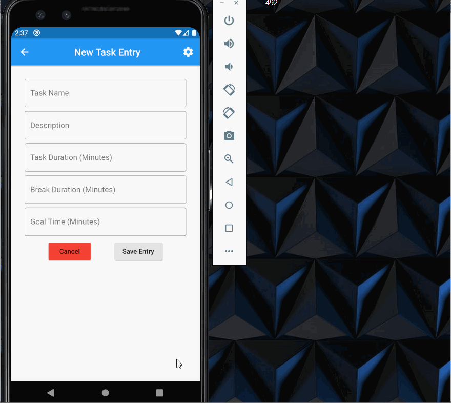

# *Pomo Mobile*

**Pomo Mobile** is a mobile app created with Dart/Flutter based on my group project CS361-Pomodoro, which is a Dart/Flutter web app.  This app utilizes SQLite as the backend instead of Firebase. The user can add and delete tasks and also toggle between light and dark mode in the settings.  A basic overview of goal progress is given in the task detail view.

## Video Walkthrough

Here's a walkthrough:

GIF created with [LiceCap](http://www.cockos.com/licecap/).
